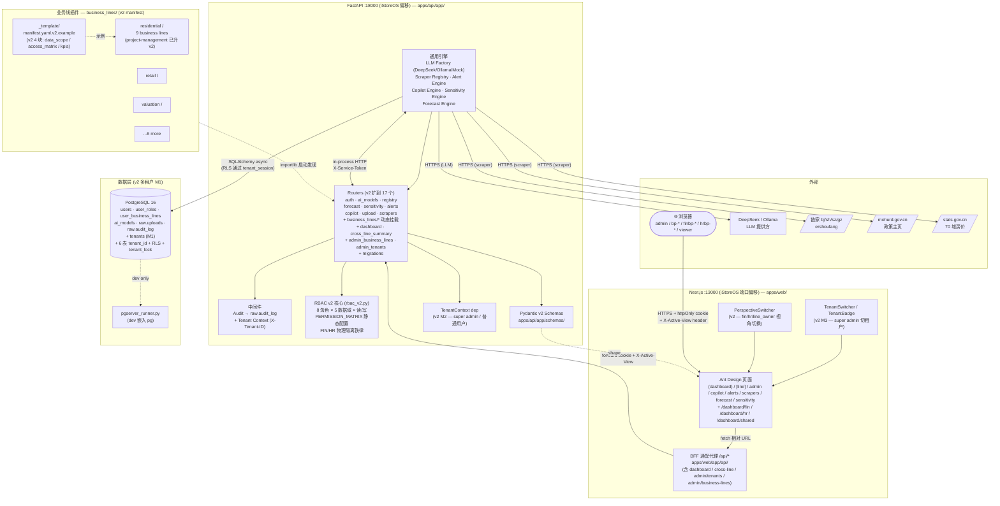
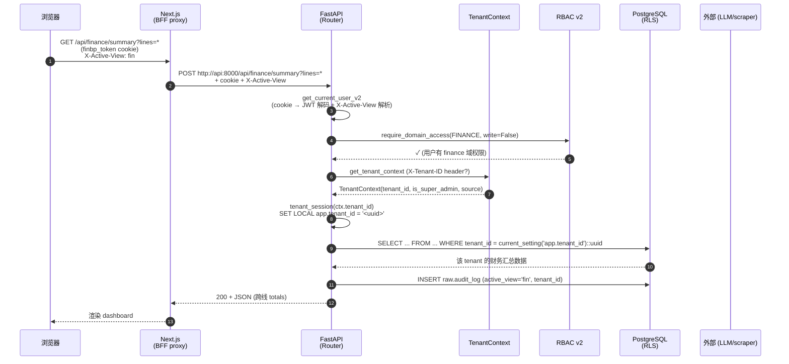
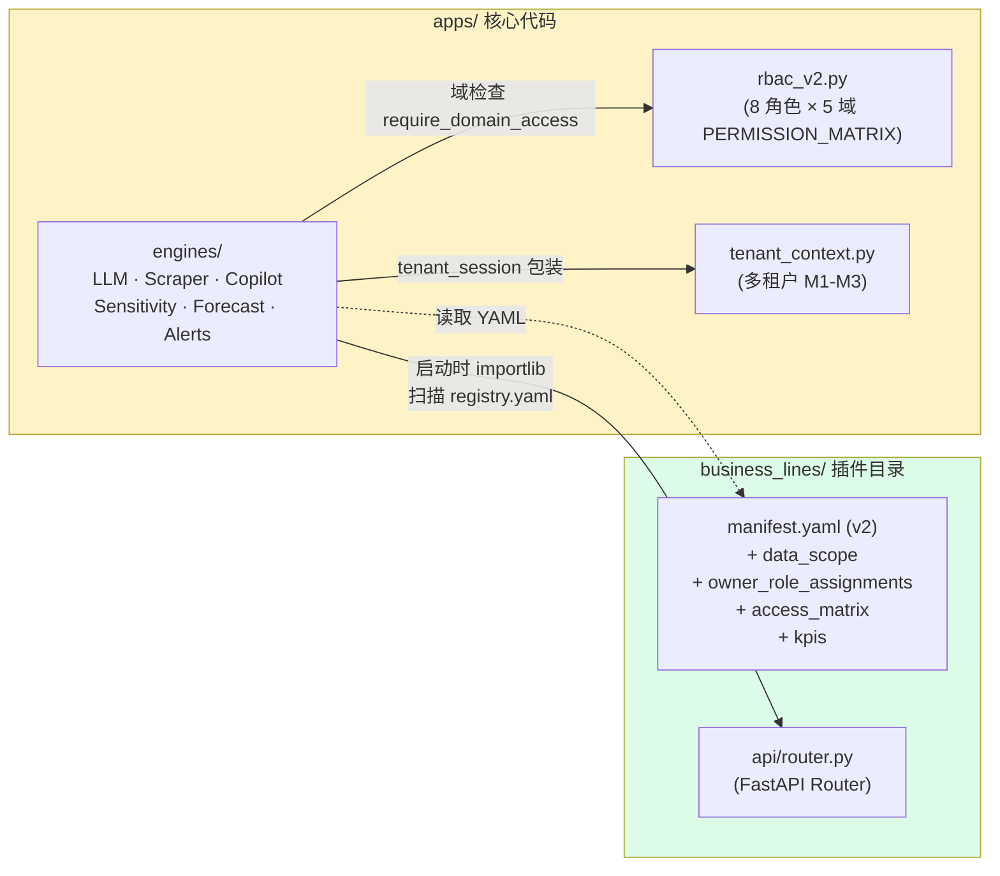

# InsightBP — 业务洞察平台 (Biz-BP Portal v2)

> **仓库地址**：<https://github.com/Njryadmin/biz-bp-portal>（private）
> **本地路径**：`C:\Users\mozzi\.mavis\workspace\biz-bp-portal`
> **远程 origin**：`https://github.com/Njryadmin/biz-bp-portal.git`
> **当前版本**：**v2.0.0** (InsightBP — post PR #1 merge, 2026-09-04)

面向房地产咨询公司的可插拔式"业务合伙人"分析门户。后端围绕
**业务线插件框架** 构建——新增一个事业部（例如 *工业地产部*）只需要
复制一个目录并修改配置，不需要改动核心代码。

**v2 阶段（PR #1 合并 master）** 升级到 **8 角色 RBAC** + **5 数据域** + **多租户 (M1-M3)** + **manifest v2** + **Admin UI** + **FIN/HR/Shared 三视角 dashboard** + **跨线汇总** + **migration runner**。**277 passed / 0 failed**，v0.1.0 全部 145 个测试仍绿（向后兼容）。

```
business_lines/<line>/         ← 每个业务线一个目录
  manifest.yaml                  ← 名称、导航、api_prefix、数仓 schema
                                 ← v2: data_scope / owner_role_assignments
                                 ←     / access_matrix / kpis
  indicators.yaml                ← 8-10 个 KPI
  api/router.py                  ← FastAPI 路由
  sensitivity.yaml               ← 4 个输入 × N 个输出 + 系数
  forecast.yaml                  ← 时间序列定义
  alerts.yaml                    ← 规则 + 阈值
  dbt/models/                    ← staging + marts SQL
  data/seed/                     ← mock 数据（真实数据替换入口）
```

四个通用引擎在运行时读取这些 YAML 文件——`apps/` 和 `infra/` 中
没有任何 `business_lines/*` 的 `import`：

| 引擎 | 功能 |
|---|---|
| **敏感性 Lab** | 双因子热力图 + 龙卷风图 + 情景对比 |
| **AI Copilot** | 跨业务线自然语言问答（可插拔 LLM：DeepSeek / Ollama / Mock），**v2 支持 FIN/HR 视角 prompt 切换** |
| **滚动预测** | 12 个月预测，含 MAPE + 偏差归因 |
| **告警中心** | 规则引擎，含严重等级 + 确认 + 历史记录 |

外加一个**爬虫框架**（国家统计局 70 城房价指数、链家成交、政策爬虫）
用于真实数据接入。

---

## 架构总览

### 一、组件拓扑



### 二、一次典型请求的生命周期（v2 多租户 + RBAC 域检查）



### 三、为什么"业务线插件"对核心零侵入



引擎**永远不** `import business_lines/*`（这是核心约束）。新业务线
= 复制 `_template/` + 改 manifest v2 + 加 routers，零行核心代码修改。

---

## 快速开始（Docker，iStoreOS 端口偏移）

> **生产部署到 iStoreOS 等端口冲突机器**：使用 `docker-compose.override.yml` 把所有端口 +10000（3000 → 13000 等）。
> 完整部署文档：[`DEPLOY.md`](DEPLOY.md) §3 / §iStoreOS 段。

```bash
# 1. 复制并编辑环境变量（真实 LLM 唯一必需的密钥是 DEEPSEEK_API_KEY）
cp .env.example .env

# 2. 构建并启动全部服务（iStoreOS 端口偏移）
docker compose -f infra/docker-compose.yml -f infra/docker-compose.override.yml --env-file .env up -d --build

# 3. 打开门户
open http://<host>:13000    # Web (iStoreOS 偏移后)
```

MVP 阶段（仅 Postgres + Redis + MinIO + API + Web 5 个服务，**关掉 ClickHouse + Airflow**）：

```bash
docker compose -f infra/docker-compose.yml -f infra/docker-compose.override.yml --env-file .env up -d --build
# clickhouse / airflow 仅在 profiles: ["full"] 启用
```

**默认服务端口**（标准 compose）：

- **Web**（Next.js 生产模式）：http://localhost:3000
- **API**（FastAPI）：http://localhost:8000
- **Airflow**：http://localhost:8080（admin/admin）
- **Postgres**：localhost:5432
- **Redis**：localhost:6379
- **ClickHouse**：localhost:8123（HTTP），localhost:9100（原生协议）
- **MinIO**：localhost:9001（控制台，finbp/finbp12345）

**iStoreOS 端口偏移**（用 override）：

| 服务 | 默认 | 偏移后 |
|---|---|---|
| Web | 3000 | **13000** |
| API | 8000 | **18000** |
| Airflow | 8080 | 18080 |
| Postgres | 5432 | 15432 |
| Redis | 6379 | 16379 |
| MinIO | 9000/9001 | 19000/19001 |
| ClickHouse | 8123/9100 | 18123/19100 |

更多生产级部署、故障排查和完整环境变量说明，参见
**[DEPLOY.md](DEPLOY.md)**。

---

## 身份认证（v2: 8 角色 RBAC + 5 数据域 + 多租户）

所有路由由 RBAC v2（基于角色的访问控制）层保护。**8 角色 + 5 数据域 + FIN/HR 物理隔离 + 多租户 M1-M3**。

首次启动时，API 会从业务线注册表自动创建以下账号（幂等——仅当 `users` 表为空时执行）：

| 用户名 | 密码 | 角色 (v2) | 可见范围 / 域 |
|---|---|---|---|
| `admin` | `admin123` | `admin` (+ `is_super_admin=TRUE` 自动) | 全部业务线，全部域**只读**，可切 tenant |
| `viewer` | —（通过 API 设置） | `viewer` | 全部业务线，全部域**只读** |
| `bp-<line>` | `bp123456` | `line_owner:<line>` (v2 backfill 自 v1 `bp:<line>`) | 仅对应业务线，全部 5 域 |
| `finbp-<line>` | `finbp123` | `fin_bp:<line>` | 仅对应业务线，business/finance/project 读写，**HR 域不可见** |
| `hrbp-<line>` | `hrbp123` | `hr_bp:<line>` | 仅对应业务线，business/hr/client/project 读写，**finance 域不可见** |
| `finbp-global` | `finbp123` | `fin_bp_global` | 跨业务线 finance 读写 + business 只读，**HR 域不可见** |
| `hrbp-global` | `hrbp123` | `hr_bp_global` | 跨业务线 hr 读写 + business 只读，**finance 域不可见** |

**`is_super_admin` 概念（v2 M2）**：`admin` 用户自动获得 `is_super_admin = TRUE`（migration 004 标记）。Super admin 可：
- 切 tenant via `X-Tenant-ID` header
- 跨租户查询（绕过 RLS via `app.bypass_rls = 'on'`）
- 创建/编辑 tenant（`POST /api/admin/tenants` / `PATCH /api/admin/tenants/{id}`）

生产环境请通过 `BIZ_BP_BOOTSTRAP_ADMIN_PASSWORD` /
`BIZ_BP_BOOTSTRAP_BP_PASSWORD` 环境变量，或在首次启动后通过
`PATCH /api/auth/users/{id}/v2-roles` 修改默认密码。

### 关键端点（v2 完整列表）

| 端点 | 方法 | 鉴权 | 用途 |
|---|---|---|---|
| `/api/auth/login` | POST | (none) | body `{username, password}`，返回 httpOnly cookie `finbp_token` |
| `/api/auth/logout` | POST | (none) | 清除 cookie |
| `/api/auth/me` | GET | any | 当前用户 v1 shape（兼容） |
| `/api/auth/me-v2` | GET | any | 当前用户 v2 shape（bindings + active_view）— **v2 新** |
| `/api/auth/me-tenant` | GET | any | 当前用户的 tenant context（tenant_id + is_super_admin）— **v2 M3 新** |
| `/api/auth/accessible-lines` | GET | any | 当前用户可见的业务线 |
| `/api/auth/users` | GET/POST | admin | 用户管理（v1 兼容） |
| `/api/auth/users/{id}` | PATCH | admin | 更新 display_name/email/password/is_active |
| `/api/auth/users/{id}/roles` | PATCH | admin | v1 角色 + 业务线分配（保留） |
| `/api/auth/users/{id}/v2-roles` | GET/PATCH | admin | **v2 角色三元组（role + scope + line_id）管理** — v2 新 |
| `/api/auth/audit-log` | GET | admin/auditor | 分页请求日志 |
| `/api/registry/lines` | GET | any | 注册表（v1 兼容） |
| `/api/dashboard/fin` | GET | any (FINANCE 域) | **v2 视角 dashboard（FINBP）** — v2 新 |
| `/api/dashboard/hr` | GET | any (HR 域) | **v2 视角 dashboard（HRBP）** — v2 新 |
| `/api/dashboard/shared` | GET | any | **v2 共享 dashboard** — v2 新 |
| `/api/finance/summary?lines=*` | GET | FINANCE 域 | **v2 跨线汇总** — v2 新 |
| `/api/hr/summary?lines=*` | GET | HR 域 | **v2 跨线汇总** — v2 新 |
| `/api/admin/business-lines` | GET | admin | 列出业务线（v1 + v2 字段） |
| `/api/admin/business-lines/{id}` | GET/PATCH | admin | **v2 在线编辑 manifest**（5 区块 + 原子写） |
| `/api/admin/tenants` | GET/POST | super admin | **v2 M3 租户管理** — v2 新 |
| `/api/admin/tenants/{id}` | PATCH | super admin | **v2 M3 租户编辑** — v2 新 |
| `/api/admin/migrations/status` | GET | admin | **v2 migration 状态** — v2 新 |
| `/api/admin/migrations/apply` | POST | super admin | **v2 migration runner** — v2 新 |
| `/api/admin/migrations/verify` | POST | super admin | **v2 drift 检测** — v2 新 |

业务线访问隔离：拥有 `bp:residential` 角色的用户无法读取
`/api/lines/retail/*`（返回 403）；`hr_bp(residential)` 调 `/api/dashboard/fin` 也返回 403（FIN/HR 物理隔离）；`/api/registry/lines` 返回的注册表已经预过滤，仪表盘侧边栏也只显示该用户有权访问的业务线。

完整设计 + 8 角色 + 5 域 + PERMISSION_MATRIX + 15 个 curl 场景 + 引导流程参见
**[docs/v2-rbac-deliverable.md](docs/v2-rbac-deliverable.md)**（**v2**，2026-09-04）。
旧 v1 (4 角色) RBAC 设计文档保留在
**[docs/rbac-2026-09-03-deliverable.md](docs/rbac-2026-09-03-deliverable.md)**（已 superseded，新增走 v2）。

---

## 快速开始（本地开发）

```bash
# 1. 安装依赖
npm install
cd apps/api && pip install -e ".[dev]" && cd ../..

# 2. 启动基础设施（Postgres、Redis、MinIO）
docker compose -f infra/docker-compose.yml up -d postgres redis minio

# 3. 启动 API（端口 8769）
$env:PYTHONPATH = "$(pwd)/apps/api"
python -m uvicorn app.main:app --app-dir apps/api --port 8769 --reload

# 4. 启动 Web（端口 3000）
npm run web:dev
```

打开 http://localhost:3000，使用 `admin` / `admin123` 登录。

---

## 已上线的业务线（9 条，v2 已删 `my-line`）

| ID | 显示名 | 领域 (v2 data_scope) |
|---|---|---|
| `residential` | 住宅分析 | business / finance / project（v2 升级中） |
| `retail` | 零售分析 | business / finance / project（v2 升级中） |
| `retail-leasing` | 零售租赁与市场报告 | business / finance / project（v2 升级中） |
| `valuation` | 估价部 | business / finance / project（v2 升级中） |
| `advisory` | 地产顾问部 | business / client / project（v2 升级中） |
| `office-leasing` | 写字楼租赁部 | business / finance / project（v2 升级中） |
| `investment` | 地产投资部 | business / finance / project（v2 升级中） |
| `project-management` | 地产项目管理部 | business / finance / hr / client / project (**v2 已升级，参考实现**) |
| `industrial` | 工业地产部 | business / finance / project（v2 升级中） |

> **v1 → v2 变更**：第 10 条 `my-line` 已删除（v2 测试 admin_v2_roles 自动 cleanup）。
> 新增第 10 条业务线参考 [`docs/v2-rbac-deliverable.md`](docs/v2-rbac-deliverable.md) §7 manifest v2 schema（5 步 + data_scope / owner_role_assignments / access_matrix / kpis 4 块）。
> 通用 5 步流程参见 [`business_lines/README.md`](business_lines/README.md)。

---

## 项目结构

```
biz-bp-portal/
├── apps/
│   ├── api/                          # FastAPI 后端 (v2 17 routers)
│   │   ├── app/
│   │   │   ├── main.py               # uvicorn 入口；lifespan 挂载业务线 + 初始化 DB
│   │   │   ├── core/
│   │   │   │   ├── auth.py           # v1 JWT + cookie (保留)
│   │   │   │   ├── auth_v2.py        # v2 CurrentUserV2 + 视角切换 (NEW)
│   │   │   │   ├── rbac.py           # v1 RBAC + require_super_admin_dep (v2 扩展)
│   │   │   │   ├── rbac_v2.py        # v2 8 角色 × 5 域 PERMISSION_MATRIX (NEW)
│   │   │   │   ├── tenant_context.py # v2 M2 多租户 dep (NEW)
│   │   │   │   ├── registry.py       # 业务线 manifest 解析 + reload
│   │   │   │   ├── config.py
│   │   │   │   ├── secret.py
│   │   │   │   └── logging.py
│   │   │   ├── db/
│   │   │   │   ├── bootstrap.py      # DDL (SCHEMA / AUTH / AI_MODELS)
│   │   │   │   ├── seed_users.py     # 1 admin + 9 BP user (v1 → v2 自动 backfill)
│   │   │   │   ├── session.py
│   │   │   │   ├── tenant.py         # v2 tenant_session helper (NEW)
│   │   │   │   └── migration_runner.py # v2 F 任务核心 (NEW)
│   │   │   ├── middleware/           # AuditMiddleware (重试一次写审计)
│   │   │   ├── routers/              # 17 个 APIRouter (v2 扩到 17)
│   │   │   │   ├── registry.py
│   │   │   │   ├── sensitivity.py / forecast.py / alerts.py
│   │   │   │   ├── copilot.py
│   │   │   │   ├── upload.py / scrapers.py
│   │   │   │   ├── auth.py           # v1 + me-v2 + me-tenant + v2-roles (v2 扩)
│   │   │   │   ├── dashboard.py      # v2 3 端点 (NEW)
│   │   │   │   ├── cross_line_summary.py # v2 2 端点 (NEW)
│   │   │   │   ├── admin_business_lines.py # v2 在线编辑 (NEW)
│   │   │   │   ├── admin_tenants.py  # v2 M3 4 端点 (NEW)
│   │   │   │   └── migrations.py     # v2 F 任务 3 端点 (NEW)
│   │   │   ├── schemas/              # Pydantic v2 响应模型
│   │   │   │   ├── auth.py / ai_models.py / upload.py / kpi.py / scraper.py
│   │   │   │   ├── dashboard.py      # v2 (NEW)
│   │   │   │   ├── cross_line_summary.py # v2 (NEW)
│   │   │   │   └── tenant.py         # v2 (NEW)
│   │   │   └── services/
│   │   │       ├── sensitivity_engine.py
│   │   │       ├── copilot_engine.py      + llm/{base,mock,deepseek,ollama,prompts}.py
│   │   │       ├── forecast_engine.py
│   │   │       ├── alert_engine.py
│   │   │       └── scrapers/{base,registry,utils,scrapers/*}
│   │   ├── pgserver_runner.py
│   │   ├── pyproject.toml
│   │   └── tests/                      # 277 passed / 0 failed
│   └── web/                          # Next.js 14 + Ant Design 5 + ECharts 5
│       ├── app/
│       │   ├── (dashboard)/{dashboard,sensitivity,copilot,forecast,alerts,scrapers,[line],[line]/[page]}
│       │   │   ├── dashboard/fin/page.tsx     # v2 (NEW)
│       │   │   ├── dashboard/hr/page.tsx      # v2 (NEW)
│       │   │   ├── dashboard/shared/page.tsx  # v2 (NEW)
│       │   │   ├── admin/
│       │   │   │   ├── users/page.tsx         # v1 + v2 角色管理 (v2 扩)
│       │   │   │   ├── business-lines/[id]/page.tsx # v2 在线编辑 (NEW)
│       │   │   │   ├── tenants/page.tsx       # v2 M3 (NEW)
│       │   │   │   ├── ai-models/page.tsx
│       │   │   │   └── layout.tsx
│       │   │   └── _components/
│       │   │       ├── Topbar.tsx
│       │   │       ├── PerspectiveSwitcher.tsx # v2 (NEW)
│       │   │       ├── TenantBadge.tsx          # v2 M3 (NEW)
│       │   │       ├── TenantSwitcher.tsx       # v2 M3 (NEW)
│       │   │       ├── SidebarMenu.tsx
│       │   │       └── RoleSwitcher.tsx
│       │   ├── api/                    # BFF 代理（/api/* → API:8769）
│       ├── middleware.ts               # 全站 cookie 守卫
│       └── package.json
│
├── business_lines/                 # 插件：9 条业务线 × 每条 8 个文件 (v2 删 my-line)
│   ├── registry.yaml               # 9 条业务线的清单（每次新增要 +1 行）
│   ├── _template/                  # 5 步复制-修改模板 + manifest.yaml.v2.example
│   ├── residential/  retail/  retail-leasing/  valuation/  advisory/
│   ├── office-leasing/  investment/  project-management/  industrial/
│
├── packages/
│   ├── types/                # 跨前端共享的 TS 类型
│   └── ui/                   # UniversalKpiCard, UniversalChart, EmptyState, RoleSwitcher
│
├── infra/                          # 部署与编排
│   ├── docker-compose.yml          # 7 服务栈
│   ├── docker-compose.override.yml # v2 iStoreOS 端口偏移 (NEW)
│   ├── migrations/                 # v2 4 份 migration (001_rbac_v2 / 002_placeholder / 003_multi_tenant / 004_tenant_m2)
│   ├── airflow/dags/
│   ├── dbt/                        # DBT models
│   └── .env.example
│
├── data/landing/                   # CSV/Excel/JSON 落地区
├── docs/                           # 全部交付文档 (v2 新增 6 份)
│   ├── v2-rbac-deliverable.md     # v2 RBAC 完整设计 (NEW)
│   ├── multi-tenant-deliverable.md # v2 M1-M3 (NEW)
│   ├── dashboard-deliverable.md   # v2 E 任务 (NEW)
│   ├── cross-line-summary-deliverable.md # v2 G 任务 (NEW)
│   ├── migration-runner-deliverable.md   # v2 F 任务 (NEW)
│   ├── admin-business-line-deliverable.md # v2 D1+D2 (NEW)
│   ├── rbac-2026-09-03-deliverable.md    # v1 RBAC (superseded, 保留为历史)
│   └── ... (其它 v1 文档)
│
├── .env.example                    # 环境变量模板
├── .dockerignore
├── .gitignore
└── README.md
```

---

## 架构承诺

以下承诺由代码库强制执行，并在 `docs/architecture-audit-2026-09-03.md` 中验证：

1. **禁止 `business_lines/*` 的 import**——`apps/` 和 `infra/` 中都没有
2. **新增业务线 = 0 行核心代码改动**
3. **4 个通用引擎** 适用于所有具备 YAML 配置的业务线
4. **LLM 可插拔**：当 `DEEPSEEK_API_KEY` 缺失时自动回退到 `MockBackend`
5. **DBT 和爬虫** 也通过目录扫描自动发现
6. **v2 RBAC**：8 角色 + 5 域 + FIN/HR 物理隔离 — `apps/api/app/core/rbac_v2.py` 静态配置
7. **v2 多租户**：RLS (PostgreSQL) + 6 表 tenant_id + super admin 切租户 + 触发器 fallback

---

## 版本

| 版本 | 日期 | 状态 | 关键变更 |
|---|---|---|---|
| **v2.0.0** | 2026-09-04 | **当前 (InsightBP)** | PR #1 合并 master; 8 角色 RBAC v2 + 5 数据域 + manifest v2 + Admin UI + Dashboard MVP + 跨线汇总 + 多租户 M1-M3 + migration runner; 277 passed |
| v0.1.0 | 2026-09-03 | 已 superseded | 4 角色 RBAC + 10 业务线 (含 my-line) + 4 通用引擎 + LLM + 爬虫; 145 passed |
| T0 | 2026-08 | 已 superseded | 初始交付（详见 `docs/deliverable-t0.md`） |

完整变更日志：[`docs/changelog.md`](docs/changelog.md)。

---

## 许可证

内部使用。
