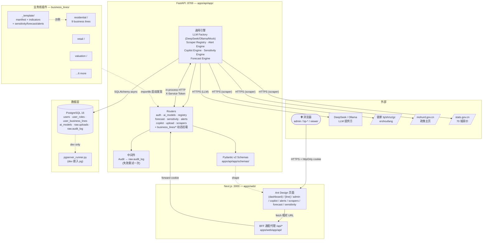
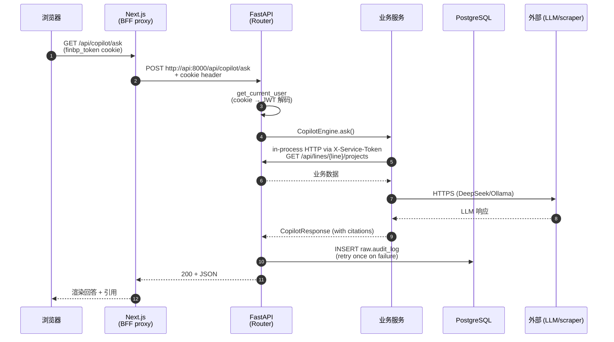
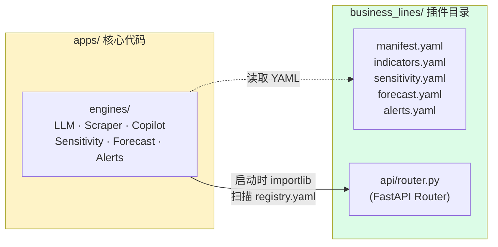

# Biz-BP Portal

> **仓库地址**：<https://github.com/Njryadmin/biz-bp-portal>（private）
> **本地路径**：`C:\Users\mozzi\.mavis\workspace\biz-bp-portal`
> **远程 origin**：`https://github.com/Njryadmin/biz-bp-portal.git`

面向房地产咨询公司的可插拔式"业务合伙人"分析门户。整个后端围绕
**业务线插件框架** 构建——新增一个事业部（例如 *工业地产部*）只需要
复制一个目录并修改配置，不需要改动核心代码。

```
business_lines/<line>/         ← 每个业务线一个目录
  manifest.yaml                  ← 名称、导航、api_prefix、数仓 schema
  indicators.yaml                ← 8-10 个 KPI
  api/router.py                  ← FastAPI 路由
  sensitivity.yaml               ← 4 个输入 × N 个输出 + 系数
  forecast.yaml                  ← 时间序列定义
  alerts.yaml                    ← 规则 + 阈值
  dbt/models/                    ← staging + marts SQL
  data/seed/                     ← mock 数据（真实数据替换入口）
```

四个通用引擎在运行时读取这些 YAML 文件——`apps/` 和 `infra/` 中
没有任何 `business_lines/*` 的 `import`：

| 引擎 | 功能 |
|---|---|
| **敏感性 Lab** | 双因子热力图 + 龙卷风图 + 情景对比 |
| **AI Copilot** | 跨业务线自然语言问答（可插拔 LLM：DeepSeek / Ollama / Mock） |
| **滚动预测** | 12 个月预测，含 MAPE + 偏差归因 |
| **告警中心** | 规则引擎，含严重等级 + 确认 + 历史记录 |

外加一个**爬虫框架**（国家统计局 70 城房价指数、链家成交、政策爬虫）
用于真实数据接入。

---

## 架构总览

### 一、组件拓扑



### 二、一次典型请求的生命周期



### 三、为什么"业务线插件"对核心零侵入



引擎**永远不** `import business_lines/*`（这是核心约束）。新业务线
= 复制 `_template/` + 改 manifest + 加 routers，零行核心代码修改。

---

## 快速开始（Docker）

```bash
# 1. 复制并编辑环境变量（真实 LLM 唯一必需的密钥是 DEEPSEEK_API_KEY）
cp .env.example .env

# 2. 构建并启动全部服务
docker compose -f infra/docker-compose.yml --env-file .env up -d --build

# 3. 打开门户
open http://localhost:3000
```

就这样。共启动 7 个服务：
- **Web**（Next.js 生产模式）：http://localhost:3000
- **API**（FastAPI）：http://localhost:8000
- **Airflow**：http://localhost:8080（admin/admin）
- **Postgres**：localhost:5432
- **Redis**：localhost:6379
- **ClickHouse**：localhost:8123（HTTP），localhost:9100（原生协议）
- **MinIO**：localhost:9001（控制台，finbp/finbp12345）

更多生产级部署、故障排查和完整环境变量说明，参见
**[DEPLOY.md](DEPLOY.md)**。

---

## 身份认证

所有路由由 RBAC（基于角色的访问控制）层保护。首次启动时，API
会从业务线注册表自动创建以下账号（幂等——仅当 `users` 表为空时执行）：

| 用户名 | 密码 | 角色 | 可见范围 |
|---|---|---|---|
| `admin` | `admin123` | `admin` + `auditor` | 全部 |
| `viewer` | —（通过 API 设置） | `viewer` | 全部，只读 |
| `bp-<line>` | `bp123456` | `bp:<line>` | 仅对应业务线 |

生产环境请通过 `BIZ_BP_BOOTSTRAP_ADMIN_PASSWORD` /
`BIZ_BP_BOOTSTRAP_BP_PASSWORD` 环境变量，或在首次启动后通过
`PATCH /api/auth/users/{id}/roles` 修改默认密码。

关键端点：

- `POST /api/auth/login` —— body `{username, password}`，返回 httpOnly cookie `finbp_token`
- `POST /api/auth/logout` —— 清除 cookie
- `GET  /api/auth/me` —— 当前用户 + 角色 + accessible_lines
- `GET  /api/auth/accessible-lines` —— 当前用户可见的业务线
- `GET  /api/auth/users`（admin）/ `POST`（admin）/ `PATCH /users/{id}/roles`（admin）
- `GET  /api/auth/audit-log`（admin/auditor）—— 分页请求日志

业务线访问隔离：拥有 `bp:residential` 角色的用户无法读取
`/api/lines/retail/*`（返回 403），`/api/registry/lines` 返回的注册表
已经预过滤，仪表盘侧边栏也只显示该用户有权访问的业务线。

完整设计 + 15 个 curl 场景 + 引导流程参见
**[docs/rbac-2026-09-03-deliverable.md](docs/rbac-2026-09-03-deliverable.md)**。

---

## 快速开始（本地开发）

```bash
# 1. 安装依赖
npm install
cd apps/api && pip install -e ".[dev]" && cd ../..

# 2. 启动基础设施（Postgres、Redis、ClickHouse、MinIO、Airflow）
docker compose -f infra/docker-compose.yml up -d postgres redis minio

# 3. 启动 API（端口 8769）
$env:PYTHONPATH = "$(pwd)/apps/api"
python -m uvicorn app.main:app --app-dir apps/api --port 8769 --reload

# 4. 启动 Web（端口 3000）
npm run web:dev
```

打开 http://localhost:3000。

---

## 已上线的业务线

| ID | 显示名 | 领域 |
|---|---|---|
| `residential` | 住宅分析 | 销售 / IRR / 三道红线 / 回款 |
| `retail` | 零售分析 | NOI / 坪效 / 品牌组合 / 改造 NPV |
| `retail-leasing` | 零售租赁与市场报告 | 租赁成交 / 市场对标 |
| `valuation` | 估价部 | 报告 / 准确度 / 回款 |
| `advisory` | 地产顾问部 | 项目 / 续约 / 客户 |
| `office-leasing` | 写字楼租赁部 | 成交 / 楼宇 / 经纪人 |
| `investment` | 地产投资部 | 基金 / 组合 / 退出 |
| `project-management` | 地产项目管理部 | 进度 / 预算 / 满意度 |
| `industrial` | 工业地产部 | 仓储 / 出租率 / 租户 |
| `my-line` | （演示） | 体验插件机制 |

如需新增第 11 条业务线，参见
**[business_lines/README.md](business_lines/README.md)**——只需 5 步复制-修改。

---

## 项目结构

```
fin-bp-portal/
├── apps/
│   ├── api/                  # FastAPI + 4 个引擎 + 爬虫框架
│   │   ├── app/
│   │   │   ├── services/
│   │   │   │   ├── sensitivity_engine.py
│   │   │   │   ├── copilot_engine.py      + llm/{base,mock,deepseek,ollama,prompts}.py
│   │   │   │   ├── forecast_engine.py
│   │   │   │   ├── alert_engine.py
│   │   │   │   └── scrapers/{base,registry,utils,scrapers/*}
│   │   │   ├── routers/{registry,sensitivity,copilot,forecast,alerts,scrapers,upload}.py
│   │   │   └── main.py
│   │   ├── Dockerfile
│   │   ├── pyproject.toml
│   │   └── tests/                      # 85+ tests
│   └── web/                  # Next.js 14 + Ant Design 5 + ECharts 5
│       ├── app/
│       │   ├── (dashboard)/{dashboard,sensitivity,copilot,forecast,alerts,scrapers,[line],[line]/[page]}
│       │   └── api/                    # BFF proxies
│       ├── Dockerfile
│       └── package.json
├── business_lines/           # 插件：10 条业务线 × 每条 8 个文件
├── packages/
│   ├── types/                # 共享 TypeScript 类型
│   └── ui/                   # UniversalKpiCard, UniversalChart, EmptyState, RoleSwitcher
├── infra/
│   ├── docker-compose.yml    # 7-service 编排
│   ├── airflow/dags/
│   ├── dbt/                  # DBT models
│   └── .env.example
├── data/landing/             # CSV/Excel/JSON 落地区
├── docs/                     # 全部交付文档
├── .env.example              # 环境变量模板
├── .dockerignore
├── .gitignore
└── README.md
```

---

## 架构承诺

以下承诺由代码库强制执行，并在 `docs/architecture-audit-*.md` 中验证：

1. **禁止 `business_lines/*` 的 import**——`apps/` 和 `infra/` 中都没有
2. **新增业务线 = 0 行核心代码改动**
3. **4 个通用引擎** 适用于所有具备 YAML 配置的业务线
4. **LLM 可插拔**：当 `DEEPSEEK_API_KEY` 缺失时自动回退到 `MockBackend`
5. **DBT 和爬虫** 也通过目录扫描自动发现

---

## 许可证

内部使用。
