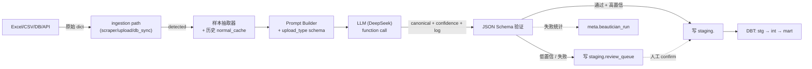

# AI 数据整容 — 需求规格

> **状态**：草稿（待定，2026-09-04 搁置）
> **作者**：Mavis orchestrator
> **背景会话**：Biz-BP Portal 0.x（rebrand 后）

---

## 1. 背景

Biz-BP Portal 当前已有 3 路数据来源（lianjia、mohurd、stats.gov.cn），全部是
**公开网络爬虫**。当开始对接企业内部数据时，会遇到 4 类**异构**源：

1. **Excel/CSV 手工上传**（分析师每周导出）
2. **内部数据库**（CRM、银行贷款、ERP）
3. **内部 REST API**（主数据系统、第三方 SaaS）
4. **文件落地**（SFTP / 邮箱附件 / 共享盘）

**核心痛点**：每路源的 schema 都不一样（column 名、值枚举、日期格式、单位、
PII 字段），但 DBT 下游只能面对**一份干净的标准表**。

**当前架构的弱点**：所有异构数据直接进 `raw.uploads`（JSONB 兜底），靠 DBT
各自写 staging model 手工做字段映射。**新增数据源 = 写一个新的 DBT 解析
+ 手工清洗 = 重活**。

## 2. 目标与非目标

### 2.1 目标（v1.0）

1. **统一 upload_type 数据规范**：每种业务数据声明一份 YAML schema（字段名、
   类型、enum、必填、min/max、PII 标记）。
2. **AI-Copilot 整容中间层**：所有源数据进 `raw_uploads` 之前先过一次 LLM
   "beautician"：自动做 column 映射、值归一化、脏数据清洗，输出符合
   upload_type schema 的 canonical JSON。
3. **硬约束不依赖 LLM**：enum / 数值范围 / 必填由 JSON Schema 验证，**绕过
   LLM 幻觉**。
4. **不确定进 review 队列**：LLM 置信度低的行进 `staging.review_queue` 等人工
   审核，不阻塞主流程。
5. **admin UI 治理**：可视化每个 upload_type 的 schema、样本、置信度分布、
   review_queue 积压。

### 2.2 非目标

- ❌ 不做实时流式数据接入（只做 batch：上传 / 拉取 / 定时同步）
- ❌ 不做 OLAP / 高性能查询（DBT + Postgres 已够）
- ❌ 不替代 DBT——AI 只做"映射 + 清洗"，聚合/join/计算仍在 DBT
- ❌ 不做 unstructed 数据（图、PDF、邮件正文）解析——v1 只处理表格数据
- ❌ 不暴露 upload_type 给租户——v1 是平台内部的统一规范

## 3. 用户故事

| 编号 | 故事 |
|---|---|
| US-1 | 业务分析师上传一份 Excel，drag-drop 选业务线和 upload_type，提交。系统自动识别 column 映射、清洗数据、写入。 |
| US-2 | 数据管理员在 `/admin/upload-types` 创建新的 upload_type，定义字段约束，发布。 |
| US-3 | 数据运维配置一个数据库源（连接字符串 + SQL），系统定时同步并落库。 |
| US-4 | 审核员在 `/admin/review-queue` 查看 AI 置信度低的记录，一键 confirm 或 reject。 |
| US-5 | 任何用户查询某行数据的"transform_log"，能看到 AI 改了什么、为什么。 |

## 4. 功能需求

### FR-1 upload_type schema 注册

- **数据源**：YAML 文件 `upload_types/<type>.yaml`，加 DB 表 `meta.upload_type` + `meta.upload_type_field`
- **字段约束**：name, type(string/number/date/bool/enum), required, enum[], min/max, format(YYYY-MM-DD 等), pii(bool), description
- **版本控制**：每次发布 bump version，已落库数据保留旧 version 不回写
- **CLI 工具**：`python -m app.services.upload_types publish <name>` 同步 YAML → DB
- **admin UI**：可视化编辑器（v1 只读 + 触发 publish）

### FR-2 AI beautician 中间层

- **触发点**：所有 ingestion path（scraper / upload / db sync / api pull / file drop）写 `raw_uploads` 之前调用
- **输入**：原始 dict（Excel row / API response / DB row）+ upload_type schema + 3-5 行历史样本
- **输出**：canonical dict（符合 schema）+ `confidence` (0-1) + `transform_log` (list of changes)
- **实现**：在 `apps/api/app/services/llm/data_beautician.py`（新文件）
- **LLM 调用方式**：OpenAI function call / Anthropic tool use（结构化输出，非自由文本）
- **批处理**：每 50-100 行一个 prompt，节省 token
- **短路**：如果源 column 名已 100% 匹配 schema 字段，**跳过 LLM** 直接进 schema 验证（90% 加速）

### FR-3 硬约束验证

- **JSON Schema 验证**：每个 canonical dict 跑 jsonschema.validate
- **失败处理**：
  - 必填缺失 → 标记 row 为 `invalid_missing_field` 进 review_queue
  - enum 不匹配 → 标记 row 为 `invalid_enum` 进 review_queue
  - min/max 违反 → 标记 row 为 `invalid_range` 进 review_queue
  - type 不匹配 → 同上
- **通过的 row**：写 `staging.<line>_<type>_canonical` 表，附 `confidence` + `transform_log`

### FR-4 置信度评分

- LLM 输出 0-1 的 `confidence`
- 阈值：>= 0.9 自动入仓；0.7-0.9 抽样入仓 + 标记待复核；< 0.7 仅入 review_queue
- 阈值可配置（admin UI v1 之后）
- 评分依据：LLM 自评 + 字段匹配度（已匹配字段数 / 总字段数）+ 历史准确率

### FR-5 review_queue 工作流

- **表**：`staging.review_queue`（id, upload_type, raw_payload, beautified_payload, confidence, transform_log, source, status[pending|confirmed|rejected|fixed], assigned_to, created_at, updated_at）
- **UI**：`/admin/review-queue`，列表 + 详情，diff 视图（raw vs beautified）
- **操作**：
  - confirm：把 beautified 写入 canonical 表
  - reject：不写，保留 raw
  - fix：人工改后写入
  - bulk：批量 confirm（适用于低风险类型）
- **审计**：每次 confirm/reject/fix 写 `raw.audit_log`

### FR-6 治理 & 观测

- **admin UI**：
  - `/admin/upload-types`：CRUD schema、查看历史 schema 版本
  - `/admin/review-queue`：见 FR-5
  - `/admin/ingestion-stats`：今日 AI 整容行数、置信度分布直方图、review_queue 积压告警
- **指标**：
  - `meta.beautician_run`：每次 AI 调用的 input_tokens / output_tokens / cost_usd / duration_ms / upload_type / source_system / row_count / pass_rate
  - `meta.cache_hit`：每次跳过的 cache 命中（避免重新 LLM）

## 5. 非功能需求

| 维度 | 要求 |
|---|---|
| **NFR-1 成本** | 10 万行典型 10 字段数据集，< 150 USD（DeepSeek pricing） |
| **NFR-2 延迟** | 1000 行 < 30 秒（含 LLM 调用）；10000 行 < 5 分钟（批处理） |
| **NFR-3 准确率** | 字段映射准确率 >= 98%（用 golden sample 评测） |
| **NFR-4 幂等** | 同一份原始数据跑两次，写入的 canonical row 不重复（用 source_key 去重） |
| **NFR-5 可观测** | 每次 AI 调用都写 `meta.beautician_run`，可按 upload_type / time / source 聚合 |
| **NFR-6 安全** | 上传文件存隔离的 `meta.uploads_blob`（带 path 哈希），30 天后清理 |
| **NFR-7 可恢复** | beautician 失败 → 原始数据已写 `raw_uploads`，可重试；不能丢数据 |
| **NFR-8 离线降级** | LLM API 不可用时，**降级到纯 DBT 解析**（不调 LLM），标记 source 为 `no_llm` |

## 6. 架构

### 6.1 总体数据流



### 6.2 涉及的代码位置

| 模块 | 路径 | 改动 |
|---|---|---|
| 数据规范 | `upload_types/*.yaml` + `meta.upload_type` 表 | 新建 |
| 验证服务 | `apps/api/app/services/upload_types/`（新文件夹）| 新建 |
| 验证器 | `apps/api/app/services/upload_types/validator.py` | 新建 |
| AI beautician | `apps/api/app/services/llm/data_beautician.py` | 新建 |
| prompt 模板 | `apps/api/app/services/llm/prompts/beautician.j2` | 新建 |
| review_queue | `apps/api/app/db/tables/review_queue.py` | 新建 |
| 入口集成 | 现有 3 个 scraper + `upload.py` router | 加 beautician 调用 |
| admin UI | `apps/web/app/(dashboard)/admin/upload-types/` | 新建 |
| review UI | `apps/web/app/(dashboard)/admin/review-queue/` | 新建 |
| 观测 | `meta.beautician_run` 表 + `/admin/ingestion-stats` 页面 | 新建 |
| 文档 | `docs/AI-DATA-BEAUTICIAN-REQUIREMENTS.md`（本文档）| 已建 |

### 6.3 数据库新增表

```sql
-- meta.upload_type：每种业务数据类型的元数据
CREATE TABLE meta.upload_type (
    id SERIAL PRIMARY KEY,
    name TEXT UNIQUE NOT NULL,             -- 'contract_deal'
    display_name TEXT NOT NULL,            -- '合同成交流水'
    default_line TEXT REFERENCES registry, -- 默认归哪个业务线
    version INT NOT NULL DEFAULT 1,
    schema_json JSONB NOT NULL,            -- 完整 JSON Schema
    sample_payload JSONB,                  -- 3-5 行人工确认的 golden sample
    created_at TIMESTAMPTZ DEFAULT NOW(),
    is_active BOOLEAN DEFAULT TRUE
);

-- staging.review_queue：AI 不确定的行进这里等人工
CREATE TABLE staging.review_queue (
    id BIGSERIAL PRIMARY KEY,
    upload_type_id INT REFERENCES meta.upload_type(id),
    source TEXT NOT NULL,                  -- 'crm_v2' / 'manual_excel' / etc.
    source_key TEXT,                        -- 业务主键（幂等用）
    raw_payload JSONB NOT NULL,             -- 原始数据
    beautified_payload JSONB,               -- AI 整容后
    confidence REAL,                        -- 0-1
    transform_log JSONB,                     -- [{field, before, after, reason}]
    failure_reason TEXT,                    -- 'invalid_enum' / 'low_confidence' / etc.
    status TEXT DEFAULT 'pending',          -- pending|confirmed|rejected|fixed
    assigned_to TEXT,
    created_at TIMESTAMPTZ DEFAULT NOW(),
    updated_at TIMESTAMPTZ DEFAULT NOW()
);

-- meta.beautician_run：观测指标
CREATE TABLE meta.beautician_run (
    id BIGSERIAL PRIMARY KEY,
    upload_type_id INT REFERENCES meta.upload_type(id),
    source TEXT,
    row_count INT,
    pass_count INT,
    queue_count INT,
    fail_count INT,
    input_tokens INT,
    output_tokens INT,
    cost_usd REAL,
    cache_hit BOOLEAN DEFAULT FALSE,
    duration_ms INT,
    started_at TIMESTAMPTZ,
    finished_at TIMESTAMPTZ
);

-- meta.uploads_blob：原始文件存档（30 天后清理）
CREATE TABLE meta.uploads_blob (
    id BIGSERIAL PRIMARY KEY,
    path_hash TEXT UNIQUE NOT NULL,         -- sha256 of file contents
    source_filename TEXT,
    mime_type TEXT,
    byte_size BIGINT,
    blob BYTEA,
    uploaded_at TIMESTAMPTZ DEFAULT NOW(),
    expires_at TIMESTAMPTZ DEFAULT NOW() + INTERVAL '30 days'
);
```

## 7. AI 整容 prompt 设计

### 7.1 输入

```
System:
  You are a data normalization engine for a Chinese real-estate
  consulting firm. You take messy rows from various internal sources
  and output them conforming to a strict JSON Schema. The output is
  fed directly to a Postgres DB via DBT — wrong data types, wrong
  enum values, or invented fields will pollute downstream marts.

  RULES:
  1. NEVER invent data. If a field is missing, set to null.
  2. NEVER guess enum values. If the source value doesn't clearly
     match an allowed enum, return the value as-is and flag
     `uncertain_fields`.
  3. Transform units when obvious:
     - "1,200.50元" / "1200.5元" → 1200.5
     - "1.2万" → 12000
     - "京" / "BJ" / "Beijing" → "北京" (if enum includes "北京")
     - "2024/1/5" → "2024-01-05"
  4. For each transformed field, append a transform_log entry:
     {"field": "total_price_wan", "before": "1,200.50元", "after": 1200.5, "reason": "strip currency suffix + parse"}
  5. Confidence: 0-1 score. Lower if you had to guess or skip fields.
  6. NEVER explain yourself outside the JSON. No prose.

User:
  <upload_type_schema>...</upload_type_schema>
  <historical_sample>...</historical_sample>  // 3-5 行已确认的样本
  <raw_row>...</raw_row>
```

### 7.2 输出（function call / JSON mode）

```json
{
  "beautified": {
    "project_id": "BJ-2024-001",
    "district": "北京",
    "deal_date": "2024-01-05",
    "total_price_wan": 1200.5,
    "area_sqm": 89.5,
    "source_system": "crm_v2"
  },
  "transform_log": [
    {
      "field": "total_price_wan",
      "before": "1,200.50元",
      "after": 1200.5,
      "reason": "strip currency + parse float"
    },
    {
      "field": "district",
      "before": "京",
      "after": "北京",
      "reason": "map abbreviation to enum value"
    }
  ],
  "uncertain_fields": [],
  "confidence": 0.97
}
```

## 8. 失败模式与降级

| 失败 | 行为 |
|---|---|
| LLM API 不可用 | 跳过 beautician，直接进 schema 验证；通过的写 canonical，失败的写 review_queue；记 `meta.beautician_run.cache_hit=false, source='no_llm'` |
| LLM 幻觉（输出非法 JSON） | 重试 1 次（同 prompt），仍失败则降级到 schema 验证；记 `failure_reason='llm_invalid_json'` |
| LLM 超时（> 30s） | 跳过 LLM 同第一行 |
| 必填字段缺失 | 写 review_queue，`failure_reason='invalid_missing_field'` |
| enum 不匹配 | 写 review_queue，`failure_reason='invalid_enum'` |
| 数值范围违反 | 写 review_queue，`failure_reason='invalid_range'` |
| type 错误 | 写 review_queue，`failure_reason='invalid_type'` |

## 9. 验收标准

- [ ] `meta.upload_type` + `meta.upload_type_field` 表创建 + YAML 同步工具可用
- [ ] 至少 3 种 upload_type 已在生产跑：合同成交流水、二手成交、新挂房源
- [ ] beautician 字段映射准确率（golden sample 评测）>= 98%
- [ ] 10 万行 / 10 字段数据 < 150 USD + < 5 分钟
- [ ] LLM 不可用时数据仍能进库（降级路径）
- [ ] review_queue UI 可一键 confirm/reject/fix
- [ ] `meta.beautician_run` 记录每次调用的 token / cost / duration
- [ ] admin UI 可视化置信度分布 + review_queue 积压告警（> 100 pending → 告警）

## 10. 迁移路径

### 10.1 现有 3 个 scraper 的迁移

| Scraper | upload_type 建议 | LLM 作用 |
|---|---|---|
| lianjia_deals | `lianjia_ershoufang_listing` | city 简写展开、price 数字提取 |
| nbs_house_price | `nbs_70city_house_price` | city name 标准化、date 格式 |
| policy_crawler | `mohurd_policy_release` | 标题去重、severity 分类 |

迁移策略：在每个 scraper 的 `persist()` 之前插 beautician 调用，旧 stg_* 模型数据自动迁移（DBT incremental）

### 10.2 渐进上线

1. **Week 1**：DB schema + JSON Schema 验证器（无 LLM 路径）
2. **Week 2**：3 种 upload_type YAML + beautician 接入 1 个新源（如：业务部门手动 Excel 上传）
3. **Week 3**：admin UI + review_queue
4. **Week 4**：观测 + 优化 + 把 3 个现有 scraper 接入

## 11. 开放问题

1. **PII 字段在 LLM 调用时如何脱敏？** 方案：调用前对 phone/email/id_card 做 SHA256 哈希占位，LLM 只看到 hash，验证后回填。建议在 v1 就做。
2. **大文件（> 1MB Excel）流式处理**？v1 限定 < 10MB，超出走 review_queue。
3. **多源合并去重**：同一 contract 在 crm_v2 和 bank_oracle 各出现一次，source_key 怎么定？v1 用 `${source_system}:${primary_key}` 拼接去重，v2 用 embedding 相似度。
4. **LLM provider 切换**：v1 只用 DeepSeek，架构上要支持多 provider。复用 `apps/api/app/services/llm/factory.py` 已有的抽象。
5. **YAML 编辑 UI**：v1 是 CLI 发布（YAML 写盘 → `python -m app.services.upload_types publish`），admin UI 编辑器延后到 v1.1。
6. **observability vs 隐私**：把 `raw_payload` / `beautified_payload` 写日志可能泄漏敏感信息，metrics 表只存 row_count / token / cost，不存 payload。

## 12. 文档与参考

- 相关代码：
  - `apps/api/app/services/scrapers/` — 现成的"adapter pattern"，AI beautifier 复用
  - `apps/api/app/services/llm/factory.py` — LLM provider 抽象
  - `apps/api/app/services/llm/prompts.py` — 现有 prompt 模板
  - `apps/api/app/routers/upload.py` — 现有 upload 路由
  - `apps/api/app/db/audit.py` — audit 中间件样板
- 相关 doc：
  - `MAINTENANCE.md`
  - `AGENTS.md`
  - `docs/maintenance/extending.md`（将来在此处加 "添加新 upload_type" 章节）
  - `docs/maintenance/troubleshooting.md`（将来加 "AI 整容异常" 章节）
  - `docs/maintenance/architecture-decisions.md`（应补 ADR：为什么用 LLM 整容）

## 13. 时间线（建议）

| Phase | 周期 | 内容 | ROI |
|---|---|---|---|
| P0 探索 | 1 周 | 选 1 个真实业务部门，做"人工映射"基线 | 验证价值 |
| P1 v0.1 | 2 周 | DB schema + YAML + JSON Schema 验证器（无 LLM）| 80% 异构 → 标准化价值 |
| P2 v0.5 | 2 周 | AI beautician + 3 种 upload_type + review_queue | 节省 90% 人工映射 |
| P3 v1.0 | 2 周 | admin UI + 观测 + 性能优化 | 治理 + 可观测 |
| P4 v1.1 | 持续 | LLM 缓存、batch 优化、新源接入 | 边际成本递减 |

---

> **最后更新**：2026-09-04 by Mavis
> **状态**：草稿待评审（用户搁置，未排期）
