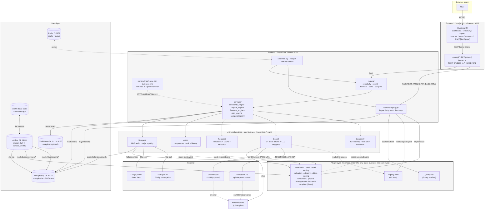
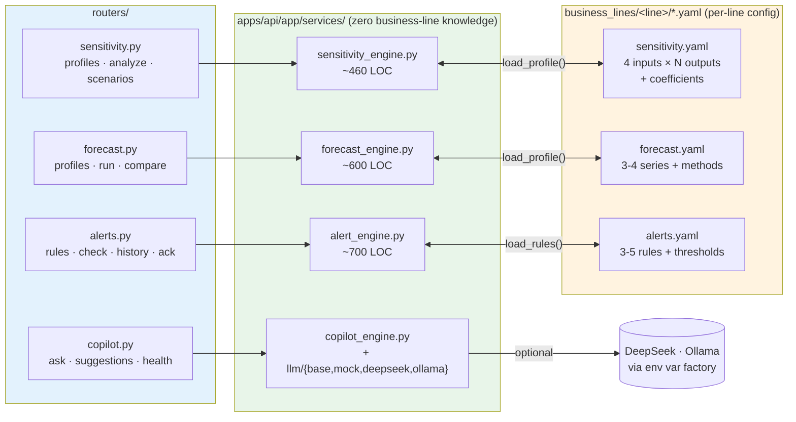
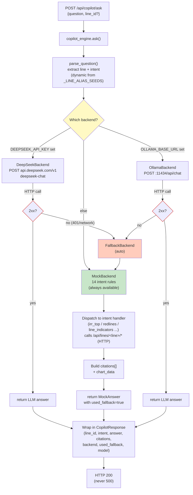
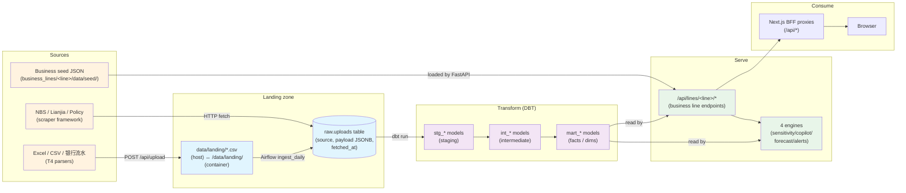
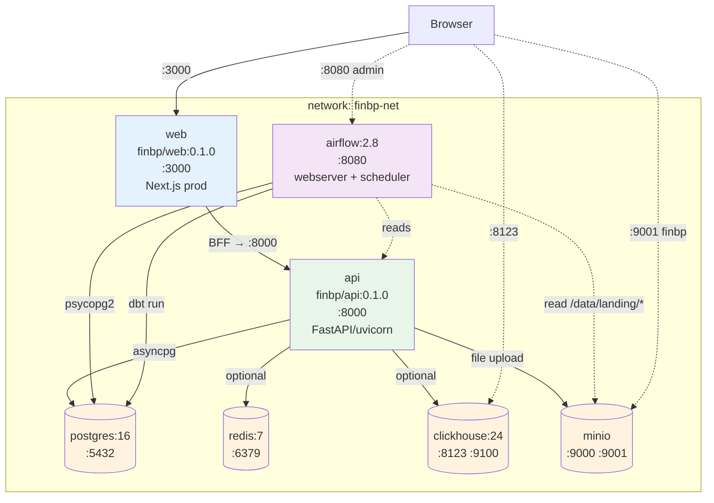

# Fin BP Portal — 架构概览

> 生成于 2026-09-03，依据架构审计报告（`docs/architecture-audit-2026-09-03.md`）。
> **10/11 架构承诺 PASS · 通用性已验证 · 0 P0/P1 问题**。

本文档是审计报告的可视化伴侣。五张图，每张都标注了实现该承诺的代码位置。

---

## 图 1 — 系统分层架构（整体分层）

整个系统，从浏览器到数据库，标注代码所在、数据流动、密钥接入的边界。



**关键边界不变量**（已由审计验证）：

1. **`apps/api/app/routers/registry.py` 之外没有任何 `import business_lines.X`**
2. **`apps/web/app/` 中没有 `from @fin-bp/...` 形式的业务线组件** —— 只能通过 `[line]/[page]` 动态路由
3. **引擎在运行时从 `business_lines/<line>/` 读取 YAML**，不进行 Python import
4. **密钥仅通过环境变量进入** —— 仓库中没有 `.env`，`.env.example` 是模板

---

## 图 2 — 插件机制（业务线插件机制）

`business_lines/<line>/` 如何在不动核心代码的前提下成为活的 API + UI。
三件事共同发挥作用：注册表文件、importlib 加载器、模板。

```mermaid
sequenceDiagram
    autonumber
    participant Dev as Developer
    participant BL as business_lines/test-line/
    participant Reg as business_lines/registry.yaml
    participant Code as apps/api/app/routers/registry.py
    participant FastAPI as uvicorn (startup)
    participant Browser

    Note over Dev,BL: 1. 复制模板（5 步新增业务线工作流）
    Dev->>BL: cp -r business_lines/_template business_lines/test-line<br/>edit manifest.yaml + indicators.yaml<br/>+ sensitivity/forecast/alerts.yaml<br/>+ api/router.py (one FastAPI router)

    Note over Dev,Reg: 2. 注册（一行）
    Dev->>Reg: Append: - id: test-line<br/>&nbsp;&nbsp;manifest: business_lines/test-line/manifest.yaml

    Note over FastAPI: 3. 重启 API（核心代码 0 改动）
    FastAPI->>Code: lifespan → load_business_lines()
    Code->>Reg: yaml.safe_load
    Reg-->>Code: lines: [{id: test-line, ...}]
    loop for each line
        Code->>BL: importlib.util.spec_from_file_location(<br/>&nbsp;&nbsp;f"business_lines.{id}.router",<br/>&nbsp;&nbsp;f"business_lines/{id}/api/router.py")
        Code->>BL: module_from_spec + exec_module
        Code->>FastAPI: app.include_router(router, prefix=api_prefix)
    end
    FastAPI-->>FastAPI: Routers mounted at /api/lines/&lt;id&gt;/*

    Note over Browser: 4. 使用
    Browser->>FastAPI: GET /api/registry/lines
    FastAPI-->>Browser: 11 lines (incl. test-line)
    Browser->>FastAPI: GET /api/lines/test-line/ping
    FastAPI-->>Browser: {"status":"ok",...}
```

**已通过审计验证**（通用性测试通过）：

- 新增 `business_lines/test-line/` + 在 `registry.yaml` 添加 1 行 → 0 核心代码改动
- 4 个引擎全部自动发现 test-line：
  - `/api/registry/lines` 数量从 10 → 11
  - `/api/sensitivity/profiles` 数量从 9 → 10
  - `/api/forecast/profiles` 数量从 9 → 10
  - `/api/alerts/profiles` 数量从 9 → 10
- 移除 → API 回到 10 条业务线，无遗留

---

## 图 3 — 通用引擎（4 引擎通用性）

同一份引擎代码服务 10 条业务线。唯一的差异是 YAML。



**契约经审计验证**（`grep -r "residential\|retail" apps/api/app/services/`）：

| 引擎 | 读取自 | 写入至 | 是否硬编码业务线名称？ |
|---|---|---|---|
| Sensitivity | `business_lines/<line>/sensitivity.yaml` | 仅响应 | ❌ 否 |
| Copilot | `load_registry()` + `_LINE_ALIAS_SEEDS` | 响应 + debug.parsed | ⚠️ 仅 alias 字典（P2） |
| Forecast | `business_lines/<line>/forecast.yaml` | 仅响应 | ❌ 否 |
| Alerts | `business_lines/<line>/alerts.yaml` | 内存存储 | ❌ 否 |

审计中标记的 **3 处 P2 问题** 都与 UX 完整性相关
（LLM 提示的目录、建议问题、UI 页面映射），而非核心代码知识。不破坏通用性。

---

## 图 4 — AI Copilot 降级链

LLM 后端如何被选中，以及失败时如何兜底。



**契约**：Copilot 端点**绝不会因 LLM 失败而返回 HTTP 500**。要么真实 LLM 回答，
要么规则引擎以 `used_fallback=true` 加 `fallback_reason` 解释哪里出错来回答。

已线上验证：
- `DEEPSEEK_API_KEY=fake-key` → `used_fallback=true`，`fallback_reason="DeepSeekHTTPError: HTTP 401: ..."`，HTTP 200。
- 无 key → 从一开始就是 mock，`used_fallback=false`，`backend=mock`。

---

## 图 5 — 数据流

数据从哪里来，落在哪里，如何到达用户。



**延迟预算**：
- Excel 上传 → 落地区：< 1s
- Airflow DAG → raw.uploads：按计划（或手动触发）
- DBT 运行：1-5 分钟
- 从 marts 读取的 API 响应：< 100ms（Postgres 索引）

---

## 图 6 — Docker Compose 部署

7 个服务在生产中如何连接。



**启动顺序由 `depends_on: condition: service_healthy` 强制**：
`postgres` → `api` → `web`，`redis/minio/clickhouse/airflow` 为兄弟节点。

---

## 审计总结表

| # | 承诺 | 实现 | 证据 |
|---|---|---|---|
| A1 | 核心代码无业务线硬编码 | ✅ | `grep` 除 alias dict 外 0 命中 |
| A2 | 业务线自动发现 | ✅ | importlib 真实工作 |
| A3 | 加业务线零代码改动 | ✅ | universality test: add/remove test-line |
| B1 | engine 读业务线 YAML | ✅ | sensitivity_engine / forecast_engine / alert_engine |
| B2 | LLM 抽象层 | ✅ | base.py + 3 backend + Fallback |
| B3 | scraper 框架 | ✅ | base.py + 3 scrapers + RLock |
| C1 | 前端动态路由 | ✅ | `[line]/page.tsx` + `[line]/[page]/page.tsx` |
| C2 | 5 个引擎页 | ✅ | /sensitivity /copilot /forecast /alerts /scrapers |
| C3 | Topbar 完整 | ✅ | 含业务线 + 5 引擎 + scrapers |
| D | 业务线 8 文件齐 | ✅ | 10 业务线 × 8-10 文件（含 _sources.yml）|
| E | 配置一致 | ✅ | registry.yaml + .env.example + docker-compose |
| F | env 变量覆盖所有可配置 | ⚠️ P2 | 3 处 catalog 硬编码（不影响功能）|

**通用性得分**：10/11 PASS，1 PASS-with-P2-notes。
**P0/P1 问题数**：0。
**是否可交付**：✅
